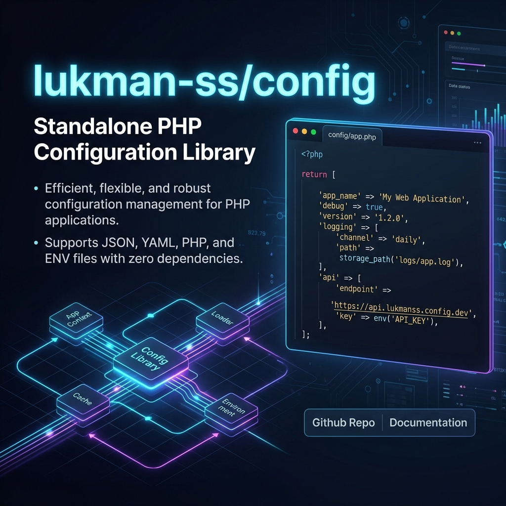

# lukman-ss/config



Standalone PHP configuration library with a repository, typed getters, `.env` loading, PHP config file loading, cache files, and freeze mode.

## Requirements

- PHP 8.2 or higher
- No runtime dependencies

## Installation

```bash
composer require lukman-ss/config
```

## Basic Usage

```php
use Lukman\Config\Config;

$config = new Config();

$config
    ->set('app.name', 'Demo')
    ->set('app.debug', true);

$name = $config->string('app.name');
$debug = $config->bool('app.debug');
```

## Repository

```php
use Lukman\Config\Repository;

$repository = new Repository([
    'database' => [
        'host' => '127.0.0.1',
    ],
]);

$repository->set('database.port', 3306);

$host = $repository->get('database.host');
$port = $repository->int('database.port');
$all = $repository->all();
```

## Env Loader

```php
use Lukman\Config\EnvLoader;

$env = new EnvLoader();
$values = $env->load(__DIR__ . '/.env');
```

Supported scalar parsing:

- `true` and `false` to boolean
- `null` to null
- integers and floats to numeric values
- quoted values remain strings
- empty values remain empty strings

## Config File Loader

```php
use Lukman\Config\ConfigLoader;

$loader = new ConfigLoader();
$items = $loader->load(__DIR__ . '/config');
```

Only non-recursive `*.php` files are loaded. Each file must return an array. The filename becomes the namespace key.

Example `config/app.php`:

```php
<?php

declare(strict_types=1);

return [
    'name' => 'Demo',
];
```

## Cache

```php
$config->cacheTo(__DIR__ . '/bootstrap/cache/config.php');
$config->loadCache(__DIR__ . '/bootstrap/cache/config.php');
```

Cache files are plain PHP files that return an array.

## Freeze Mode

```php
$config->freeze();

$config->get('app.name');
$config->frozen();

$config->unfreeze();
$config->set('app.name', 'Updated');
```

Mutation methods throw `Lukman\Config\Exception\ConfigException` while frozen.

## Testing

```bash
composer test
```
